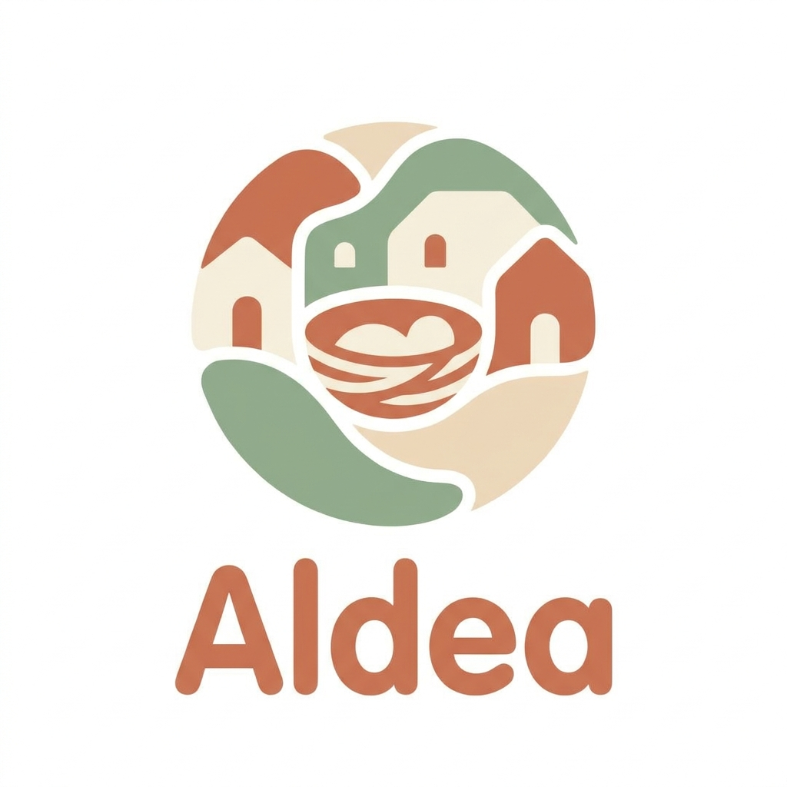

# Aldea — The Digital Village

**Private. Joyful. Premium. Built for the people who love a child most.**

Aldea makes the proverb *“It takes a village to raise a child”* real: a child-centric community platform connecting **parents**, **extended family circles**, **educators**, and **center admins** — with privacy as the foundation and AI as a genuine Premium differentiator.



## Design system (source of truth)

Ported **exactly** from the Google AI Studio / Stitch **Joyful Modernism** export:

| Token | Value |
|--------|--------|
| Primary (Terracotta) | `#9d3e20` / warm `#D66847` |
| Secondary (Sage) | `#516447` / `#7C9070` |
| Surfaces | Cream `#f5fbf9` → white containers |
| Typography | **Literata** (serif) + **Be Vietnam Pro** (sans) |
| Shape | Pill buttons, 16px cards, organic blobs |

Do not invent a new aesthetic — this palette and type pairing are mandatory.

## Business model (Hybrid B2B2C)

Aligned with *MilkyChat Business Model & Pricing Recommendation v1*:

- **Primary revenue:** B2B SaaS for childcare centers, preschools, schools (Starter → Growth → Premium/Chain → Enterprise).
- **Secondary revenue:** Parent freemium → **Plus** / **Premium** (AI-powered).
- **Free core stays rich** for network effects (timeline, moments, circles, educator updates).
- **Premium** unlocks: AI Child Journey Insights, Family Coordination Agent, keepsakes.

### Parent plans (demo pricing)

| Plan | Price | Highlights |
|------|--------|------------|
| Free | $0 | Timeline, moments, circles, messaging |
| Plus | $6.99/mo or $69/yr | Unlimited HD storage, smart albums |
| Premium | $12.99/mo or $129/yr | AI Journey + Family Assistant + advanced circles |

### B2B plans

Starter (~$99–199/mo), Growth ($2–3.50/child/mo), Premium/Chain, Enterprise (custom).

## What’s included

### Roles
- Parent / Guardian  
- Circle members (extended family)  
- Educator / Caregiver  
- Center Admin (B2B)

### Screens
- Onboarding & role selection  
- Home Timeline (highlights + rich media Moments)  
- Create Moment (audience = circles, privacy toggle)  
- Kid Profile & Circles  
- **AI Child Journey Insights** (Premium)  
- **Family Coordination Agent** (Premium)  
- **Educator Copilot** (class brief + parent drafts)  
- Center Admin dashboard (analytics, billing overview)  
- Pricing & upgrade (Free / Plus / Premium + B2B)

### AI agents (`lib/ai/agents.ts` + `/api/ai/*`)
1. **Child Journey Agent** — patterns across moments, growth dimensions, recommendations  
2. **Family Coordination Agent** — weekly digests, weekend plans, message drafts  
3. **Educator Copilot** — daily class summary + parent communication drafts  

All responses are privacy-labelled; demo mode returns high-quality structured intelligence without requiring an API key. Wire `XAI_API_KEY` later for live Grok calls if desired.

## Tech stack

- **Next.js 16** (App Router) + **TypeScript**
- **Tailwind CSS v4** with full design tokens in `@theme`
- **Framer Motion** / CSS micro-interactions
- **Sonner** toasts
- Installable **PWA** manifest
- Client state: role, plan, posts (localStorage) for a credible demo

## Getting started

```bash
cd aldea-app
npm install
npm run dev
```

Open [http://localhost:3000](http://localhost:3000).

```bash
npm run build   # production build
npm start       # serve production
```

### Demo tips
1. Complete onboarding (or skip if already stored).  
2. Use the **Parent / Teacher / Admin** switcher in the top bar.  
3. Upgrade via **Free ↑** → Premium to unlock AI Journey & Assistant.  
4. Create a moment from the terracotta **+** FAB.

## Project structure

```
app/
  (app)/           # Authenticated product shell
    page.tsx       # Home timeline
    create/        # Create moment
    insights/      # AI Child Journey
    assistant/     # Family agent
    kids/ circles/ educator/ admin/ pricing/ profile/
  onboarding/      # First-run experience
  api/ai/          # journey | assistant | educator
components/        # AppShell, MomentCard, UpgradeModal…
context/           # AldeaProvider (role, plan, posts)
lib/
  ai/agents.ts     # Agent logic
  data/mock.ts     # Design-faithful demo content
  pricing.ts       # B2B2C plans
```

## Deployment (Vercel)

```bash
npx vercel --prod
```

Or connect the GitHub repository in the Vercel dashboard.

Environment (optional for future live LLM):

```env
XAI_API_KEY=
```

## Repository

- **GitHub:** https://github.com/lionelsinaisinelnikoff/aldea-app  
- **Live preview:** (see deployment section after Vercel deploy)

---

Built with care for every village.  
Design: Joyful Modernism · Model: Hybrid B2B2C · Intelligence: Privacy-first AI agents.
